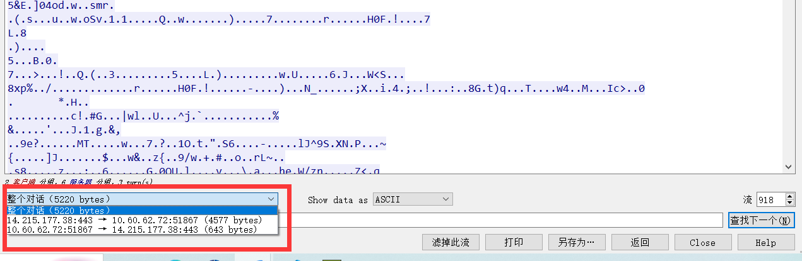

# **WireShark实验：**
---
## **WireShark基本使用：**

### **一、选择对哪块网卡进行数据包捕获：**
1. 选择那块网卡进行捕捉，选择有网络波动，并且结合本机网络
2. 开始/停止捕获：选择`WLAN`，右键，选择`Start capture`即可开始捕捉(也可以双击打开)
### **二、开始/停止捕获：**
开始捕获后自动跳转到捕捉主界面：

### **三、了解 Wireshark 主要窗口区域:**
在wireshark的抓包界面，基本分为菜单栏、工具栏、过滤栏、数据列表区、数据详细区、数据字节区和数据统计区等等   

开始/停止捕获: 这两个可以通过菜单栏中的捕获一项进行控制，同样也可以通过工具栏中的图标进行控制。
过滤栏则是快速对捕获的包进行过滤
在数据列表区选择某条数据的时候，下方数据详细区则会显示对应包的详细信息，同样数据字节区则会显示该包实际传递到数据字节，数据统计区会对其进行统计分析，在数据列表区右键还可以进行数据流的追踪。
### **四、设置数据包的过滤:**
先ping一下www.baaidu.com。、

然后，可以通过在过滤栏设置过滤条件进行数据包列表过滤。输入如下图：```（说明：ip.addr == 14.215.177.38 and icmp 表示只显示ICPM协议且源主机IP或者目的主机IP为14.215.177.38的数据包。说明：协议名称icmp要小写。）```

### **五、跟踪数据流:**
可以选取一行，右击选取追踪流中的TCP流，如图：


同时我们可以看到双方整个对话，或者选择单方，然后可以把展示数据改为原始数据，然后另存到本地，通过二进制的存储，然后利用`WinHex`等工具对原始资源进行还原。



---
## **数据链路层：**
### **实作一：熟悉 Ethernet 帧结构** 

使用 `Wireshark` 任意进行抓包，熟悉 `Ethernet` 帧的结构，如：`目的 MAC、源 MAC、类型、字段`等。如下图：
双击任意一个包，即可弹出详细信息界面，在这里选择数据链路层的`Ethernet帧`，下方即可展开该帧结构，包括`目的MAC，源MAC、类型`，下方还会高亮对应的数据字节。甚至还会根据MAC地址特点分析出设备厂家等。
✎ 问题
你会发现 `Wireshark` 展现给我们的帧中没有校验字段，请了解一下原因。

 `Wireshark会自动丢弃掉校验字段。有时校验会由网卡计算，这时Wireshark抓到的本机发送的数据包的校验和都是错误的，所以默认关闭了Wireshark自己的校验。`
### **实作二：了解子网内/外通信时的 MAC 地址**
1. `ping` 你旁边的计算机（同一子网），同时用 `Wireshark` 抓这些包（可使用 `icmp` 关键字进行过滤以利于分析），记录一下发出帧的`目的 MAC 地址`以及返回帧的`源 MAC 地址`是多少？这个 `MAC 地址`是谁的？
`这一步电脑出现了点问题，用的同学的电脑`

2. 然后 `ping qige.io` （或者本子网外的主机都可以），同时用 `Wireshark` 抓这些包（可 `icmp` 过滤），记录一下发出帧的`目的 MAC 地址`以及`返回帧的源 MAC` 地址是多少？这个 `MAC 地址`是谁的？（如下图）

`发出帧的目的mac地址 以及 返回帧的源mac地址，都为：00:74:9c:9f:40:13,发出帧的目的mac和返回帧的源mac都是网关的mac地址
`
1. 再次 `ping www.cqjtu.edu.cn` （或者本子网外的主机都可以），同时用 `Wireshark` 抓这些包（可 `icmp 过滤`），记录一下`发出帧的目的 MAC 地址`以及`返回帧的源 MAC` 地址又是多少？这个 `MAC 地址`又是谁的？(如下图)

` 和第二题一样，都是网关的mac地址，因为是访问的子网外的地址`

**✎ 问题**
通过以上的实验，你会发现：
1. 访问本子网的计算机时，`目的 MAC `就是该主机的
2. 访问非本子网的计算机时，`目的 MAC` 是网关的
请问原因是什么？
`因为访问本子网的计算机时，通过Address Rsolution Protocol，能获取到目的 主机的mac地址。但是访问非本子网的计算机时，发送的帧通过ARP没法获取到目的ip的 mac地址。此时需要借助路由器网关来获取目的主机的mac地址,所以就填网关的MAC地址。
`
### **实作三：掌握 ARP 解析过程**
1. 为防止干扰，先使用 `arp -d * `命令清空 `arp 缓存`

2. `ping` 你旁边的计算机（同一子网），同时用 `Wireshark` 抓这些包（可 `arp 过滤`），查看 `ARP` 请求的格式以及请求的内容，注意观察该请求的`目的MAC地址`是什么。再查看一下该请求的回应，注意观察该回应的`源MAC`和`目的MAC地址`是什么。

>硬件类型：占两字节，表示ARP报文可以在哪种类型的网络上传输，值为1时表示为以太网地址。
上层协议类型：占两字节，表示硬件地址要映射的协议地址类型，映射IP地址时的值为0x0800。
 MAC地址长度：占一字节，标识MAC地址长度，以字节为单位，此处为6。
IP协议地址长度：占一字节，标识IP得知长度，以字节为单位，此处为4。
操作类型：占2字节，指定本次ARP报文类型。1标识ARP请求报文，2标识ARP应答报文。
源MAC地址：占6字节，标识发送设备的硬件地址。 源IP地址：占4字节，标识发送方设备的IP地址。
目的MAC地址：占6字节，表示接收方设备的硬件地址，在请求报文中该字段值全为0，即00-00-00-00-00-00，表示任意地址，因为现在不知道这个MAC地址。
目的IP地址：占4字节，表示接受方的IP地址。

3. 再次使用 `arp -d * `命令清空`arp 缓存`
4. 然后 `ping qige.io` （或者本子网外的主机都可以），同时用 `Wireshark` 抓这些包（可 `arp 过滤`）。查看这次 `ARP` 请求的是什么，注意观察该请求是谁在回应。
`回应的源mac为所本机所在子网的网关mac地址，目的mac为本机的mac地址`
✎ 问题

通过以上的实验，你应该会发现，

1. `ARP` 请求都是使用广播方式发送的

2. 如果访问的是本子网的 `IP`，那么 `ARP` 解析将直接得到该`IP`对应的 `MAC`;如果访问的非本子网的`IP`,那么 `ARP` 解析将得到网关的`MAC`。
  请问为什么？

  `因为如果是访问本子网的ip，可以直接访问，所以ARP解析获取的就是对应ip的MAC，但如果是访问非本子网的ip时是需要经过网关发出去然后通过路由器访问，目标IP收到请求再通过路由器到达网关返回，所以ARP解析获取的就是网关的MAC`

## **网络层:**
### **实作一：熟悉 IP 包结构**
使用 `Wireshark` 任意进行抓包（可用 `ip` 过滤），熟悉 `IP` 包的结构，如：`版本、头部长度、总长度、TTL、协议类型`等字段。（如下图）


✎ 问题

为提高效率，我们应该让 `IP` 的头部尽可能的精简。但在如此珍贵的 `IP` 头部你会发现既有头部长度字段，也有总长度字段。请问为什么？

`
头部长度是来表明该包头部的长度，可以使得接收端计算出报头在何处结束及从何处开始读数据。总长度是为了接收方的网络层了解到传输的数据包含哪些，如果没有该部分，当数据链路层在传输时，对数据进行了填充，对应的网络层不会把填充的部分给去掉。
`
### **实作二：IP 包的分段与重组**
根据规定，一个 `IP` 包最大可以有 `64K` 字节。但由于 `Ethernet` 帧的限制，当 `IP` 包的数据超过 1500 字节时就会被发送方的数据链路层分段，然后在接收方的网络层重组。

缺省的，`ping` 命令只会向对方发送 32 个字节的数据。我们可以使用 `ping 202.202.240.16 -l 2000 `命令指定要发送的数据长度。此时使用 `Wireshark` 抓包（用 `ip.addr == 202.202.240.16` 进行过滤），了解 `IP` 包如何进行分段，如：分段标志、偏移量以及每个包的大小等


✎ 问题

分段与重组是一个耗费资源的操作，特别是当分段由传送路径上的节点即路由器来完成的时候，所以 `IPv6` 已经不允许分段了。那么 `IPv6` 中，如果路由器遇到了一个大数据包该怎么办？

`转发到支持该数据传输的路由上,或者丢弃该数据包并向发送方发回一个"分组太大"的ICMP差错报文，于是发送方使用较小长度的IP数据报重发数据。`
### **实作三：考察 TTL 事件**
在 IP 包头中有一个 TTL 字段用来限定该包可以在 Internet上传输多少跳（hops），一般该值设置为 64、128等。

在验证性实验部分我们使用了 tracert 命令进行路由追踪。其原理是主动设置 IP 包的 TTL 值，从 1 开始逐渐增加，直至到达最终目的主机。  
请使用 tracert www.baidu.com 命令进行追踪，此时使用 Wireshark 抓包（用 icmp 过滤），分析每个发送包的 TTL 是如何进行改变的，从而理解路由追踪原理。


`tracert` 可以找出数据包从发送者到目的地的确切路径，每一次向目标发起三个`icmp`的`Echo request`的包，并设置`TTL`从1开始，每下一次把`TTL`加1，依次往下试知道到达目的地址。`TTL`逐渐增加1直到到达目的主机。图中可以看到每次发送的`TTL`都是逐一增加的，每个都发三次。

✎ 问题
在 IPv4 中，TTL 虽然定义为生命期即 Time To Live，但现实中我们都以跳数/节点数进行设置。如果你收到一个包，其 TTL 的值为 50，那么可以推断这个包从源点到你之间有多少跳？
`
可以推测有14跳，一般来说找2的n次方离已知TTL最近的值，比如这个问题就是TTL=50，则离2的n次方最近的值为64，所以，可以推测这个包从源点到我之间有64-50=14跳。
`
## **传输层**
### **实作一：熟悉 TCP 和 UDP 段结构**
1. 用 Wireshark 任意抓包（可用 tcp 过滤），熟悉 TCP 段的结构，如：源端口、目的端口、序列号、确认号、各种标志位等字段。(如下图)

2. 用 Wireshark 任意抓包（可用 udp 过滤），熟悉 UDP 段的结构，如：源端口、目的端口、长度等。(如下图)
 

 ✎ 问题
由上大家可以看到 UDP 的头部比 TCP 简单得多，但两者都有源和目的端口号。请问源和目的端口号用来干什么？
`
源端口就是指本地端口，目的端口就是远程端口
源端口就是本机程序用来发送数据的端口，目的端口就是对方主机用哪个端口接收
`
### **实作二： 分析 TCP 建立和释放连接**
1. 打开浏览器访问 qige.io 网站，用 Wireshark 抓包（可用 tcp 过滤后再使用加上 Follow TCP Stream），不要立即停止 Wireshark 捕获，待页面显示完毕后再多等一段时间使得能够捕获释放连接的包。
2. 请在你捕获的包中找到三次握手建立连接的包，并说明为何它们是用于建立连接的，有什么特征。
3. 请在你捕获的包中找到四次挥手释放连接的包，并说明为何它们是用于释放连接的，有什么特征。

三次握手：
第一次握手客户端发送的`TCP`报文中以[SYN]作为标志位，并且客户端序号`Seq=0`
第二次握手服务器返回的`TCP`报文中以[SYN，ACK]作为标志位；并且服务器端序号`Seq=0`；确认号`Ack=1`(“第一次握手”中客户端序号`Seq`的值+1)
第三次握手”客户端再向服务器端发送的`TCP`报文中以[ACK]作为标志位；其中客户端序号`Seq=1`（“第二次握手”中服务器端确认号`Ack`的值）；确认号`Ack=1`(“第二次握手”中服务器端序号`Seq`的值+1)

四次挥手：
第一次挥手客户端发送的`FIN`请求释放连接报文以`FIN，ACK`作为标志位，其中报文序号`Seq=1316`，确认号`Ack=1442`
第二次挥手服务器端返回`ACK`同意释放连接报文以`ACK`作为标志位；其中报文序号`Seq=1442`；确认号`Ack=1317`
第三次挥手服务器端继续返回的FIN请求释放连接报文以`FIN，ACK`作为标志位；其中报文序号`Seq=1442`；确认号`Ack=1317`
第四次挥手”客户端发出的ACK确认接收报文以`ACK`作为标志位；其中报文序号`Seq=1317`；确认号`Ack=1443`

✎ 问题一
去掉 Follow TCP Stream，即不跟踪一个 TCP 流，你可能会看到访问 qige.io 时我们建立的连接有多个。请思考为什么会有多个连接？作用是什么？
`这样有多个连接，也就是于开辟了多个传输通道，这样可以加快传输数据的速度。`

✎ 问题二
我们上面提到了释放连接需要四次挥手，有时你可能会抓到只有三次挥手。原因是什么？
`在最终的数据交换有四次，将第二次、第三次挥手发出的包合并为了一个,当出现这种情况时就只能抓到三个包。
`
## **应用层**
应用层的协议非常的多，我们只对 DNS 和 HTTP 进行相关的分析。
### **实作一：了解 DNS 解析**
1. 先使用 ipconfig /flushdns 命令清除缓存，再使用 nslookup qige.io 命令进行解析，同时用 Wireshark 任意抓包（可用 dns 过滤）。
2. 你应该可以看到当前计算机使用 UDP，向默认的 DNS 服务器的 53 号端口发出了查询请求，而 DNS 服务器的 53 号端口返回了结果。
3. 可了解一下 DNS 查询和应答的相关字段的含义


当前计算机使用 UDP，向默认的 DNS 服务器的 53 号端口发出了查询请求


DNS 服务器的 53 号端口返回了结果。

`QR`：查询/应答标志。0表示这是一个查询报文，1表示这是一个应答报文
`pcode`：定义查询和应答的类型。0表示标准查询，1表示反向查询（由IP地址获得主机域名），2表示请求服务器状态
`AA`：授权应答标志，仅由应答报文使用。1表示域名服务器是授权服务器
`TC`：截断标志，仅当DNS报文使用UDP服务时使用。因为UDP数据报有长度限制，所以过长的DNS报文将被截断。1表示DNS报文超过512字节，并被截断
`RD`：递归查询标志。1表示执行递归查询，即如果目标DNS服务器无法解析某个主机名，则它将向其他DNS服务器继续查询，如此递归，直到获得结果并把该结果返回给客户端。0表示执行迭代查询，即如果目标DNS服务器无法解析某个主机名，则它将自己知道的其他DNS服务器的IP地址返回给客户端，以供客户端参考
`RA`：允许递归标志。仅由应答报文使用，1表示DNS服务器支持递归查询
`zero`：这3位未用，必须设置为0
`rcode`：4位返回码，表示应答的状态。常用值有0（无错误）和3（域名不存在）

✎ 问题
你可能会发现对同一个站点，我们发出的 DNS 解析请求不止一个，思考一下是什么原因？
`
因为我们访问的网址只有一个域名，但是并不只有一台服务器主机，因此每一台服务器的IP地址不同，但他们的域名都是相同的。因此发出的解析请求是分散给不同服务器。
`
### **实作二：了解 HTTP 的请求和应答**
1. 打开浏览器访问 qige.io 网站，用 Wireshark 抓包（可用http 过滤再加上 Follow TCP Stream），不要立即停止 Wireshark 捕获，待页面显示完毕后再多等一段时间以将释放连接的包捕获。
2. 请在你捕获的包中找到 HTTP 请求包，查看请求使用的什么命令，如：GET, POST。并仔细了解请求的头部有哪些字段及其意义。


3. 请在你捕获的包中找到 HTTP 应答包，查看应答的代码是什么，如：200, 304, 404 等。并仔细了解应答的头部有哪些字段及其意义。

✎ 问题

刷新一次 qige.io 网站的页面同时进行抓包，你会发现不少的 304 代码的应答，这是所请求的对象没有更改的意思，让浏览器使用本地缓存的内容即可。那么服务器为什么会回答 304 应答而不是常见的 200 应答？
`
200（成功） 服务器已成功处理了请求。通常，这表示服务器提供了请求的网页。如果是对您的 robots.txt 文件显示此状态码，则表示 Googl 已成功检索到该文件。
304（未修改）
自从上次请求后，请求的网页未修改过。服务器返回此响应时，不会返回网页内容。
如果网页自请求者上次请求后再也没有更改过，您应将服务器配置为返回此响应（称为 If-Modified-Since HTTP 标头）。服务器可以告Google自从上次抓取后网页没有变更，进而节省带宽和开销。
`