# **验证性实验：**
---
## **ipconfig**
### **实作一：**
使用 ```ipconfig/all``` 查看自己计算机的网络配置，尽可能明白每行的意思，特别注意 ```IP``` 地址、子网掩码 ```Subnet Mask```、网关 ```Gateway```, 如下图：


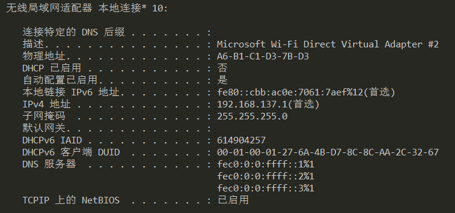


其中：
1. IPv4地址：本地在局域网内的ip地址，IPv4协议使用32位（4字节）地址，每8位划分为一个段，转换为二进制数字；
2. 本地连接IPv6地址：Ipv6协议是IPv4协议的下一个版本，其优势就在于它比IPv4有更多的可用地址。IPv6的地址长度有128位（16字节），每16位划分为一个段，转换为十六进制数字。
3. 子网掩码```Subnet Mask```：用来指明一个IP地址的哪些位标识的是主机所在的子网，以及哪些位标识的是主机的位掩码。化成二进制，前面是1的表示为网络号，后面为0的部分为主机号；
4. 默认网关```Gateway```z：默认网关ip地址，意思是一台主机如果找不到可用的网关，就把数据包发给默认指定的网关，由这个网关来处理数据包。也就是你的路由器的地址
### **实作二:**

使用 ```ipconfig/all``` 查看旁边计算机的网络配置，看看有什么异同。
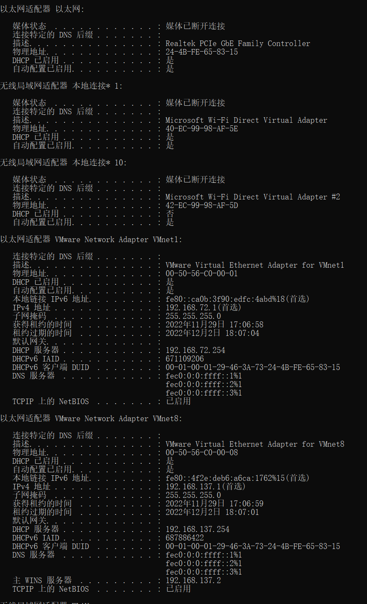
分析    
1. 无线局域网适配器 本地连接*10：无线网卡，连wifi用的，10表示设置了三个宽带连接。
2. VMnet8提供NAT和DHCP服务，VMnet1提供DHCP服务。vmnet8是让主机和虚拟机通讯用的，如果需要访问虚拟机上的相关网络服务，才需要vmnet8。 
✎ 问题
你的计算机和旁边的计算机是否处于同一子网，为什么？
`
由于IPv4的网络号相同，子网掩码相同，因此两者对应位做与运算后得到的网络地址相同，即处于同一子网
`
***

## **ping**
### **实作一:**
要测试到某计算机如 重庆交通大学 Web 服务器的连通性，可以使用 ping www.cqjtu.edu.cn 命令，也可直接使用 IP 地址。

直接使用网址ping www.cqjtu.edu.cn，结果如下图：

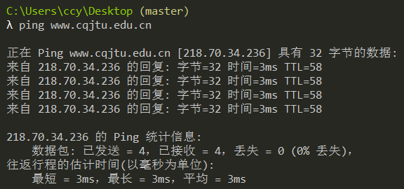
在ping的结果回复中，有三个数据，字节、时间、TTL，其中：
1. 字节表示测试时发送的数据包大小为32个字节，即对方（www.cqjtu.edu.cn）回复了本机32个字节的数据包，在默认时为32字节的负载
2. 时间表示的是对方主机往返一次所需要用到的时间；
3. TTL```(Time To Live)```表示生存时间，即ping的数据包在网络上存在的时间。当数据包传送到达一个路由器之后TTL就会自动减1，如果减到0了还是没有传送到目的主机，那么就会自动丢失，且不同操作系统下的TTL值也是不相同的。该例子中TTL=58，表示主机与 www.cqjtu.edu.cn 经过64-58=8个结点
### **实作二**
使用 ```ping/?``` 命令了解该命令的各种选项并实际使用。如下图：

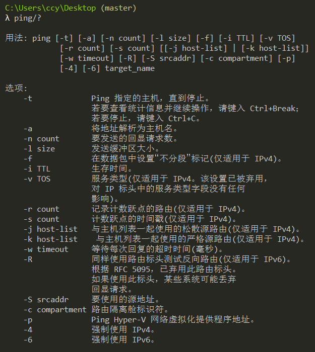
#### ***```ping -t```选项:***
当使用-t选项的时候，ping这个动作将会一直持续下去，不停的发送数据包；在`ping`这个动作在一直持续的时候，可以使用组合键`Ctrl+Break`查看`ping`到当前的统计信息，使用组合键`Ctrl+C`终止`ping`的过程,如下图：

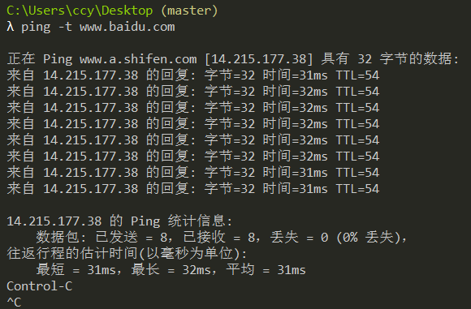
我们可以观察出，ping之后第一行有显示了一个像网址一样的东西（www.a.shifen.com），这是一个类网址，是网站防止黑客恶意攻击的一个手段。ping的时候如果不加www.，回显就不会发生变化。

#### ***`ping -a`选项:***
使用此选项可以将地址解析为计算机NetBios名。如果不适用此选项，则会直接显示IP地址；使用此选项则会将IP地址解析为主机名，可以看到本主机NetBios名为：```LAPTOP-E7MMQK1A.mshome.net``` 如下图所示：

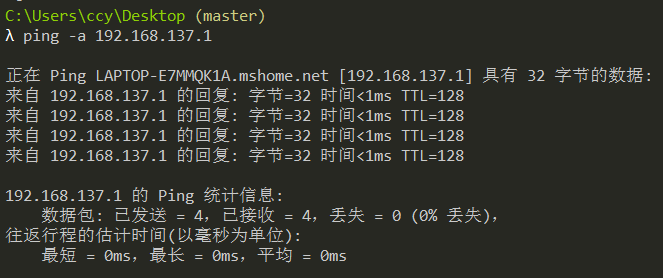

#### ***`ping -n`选项:***
此选项可以指定回显请求的次数，默认次数为4次。在`-n` 后面加数字，数字范围是从`1~4294967295`，后面加的数字即为回显请求的次数。此选项就可以任意选定回显的次数，不像默认那样死板，也不像`-t`选项不停止,如下图所示：

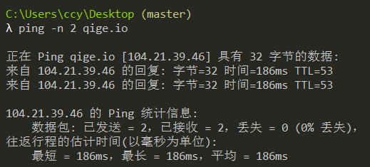


***
## **tracert**
### **实作一：**
`Tracert`（跟踪路由）是路由跟踪实用程序，用于确定```IP``` 数据报访问目标所采取的路径。```Tracert``` 命令用 ```IP``` 生存时间 ```(TTL) ```字段和``` ICMP``` 错误消息来确定从一个主机到网络上其他主机的路由。```Tracert```详细讲解：[网络小课堂-什么是 Tracert（路由追踪）命令](https://www.bilibili.com/video/BV1ja411P7m2/?spm_id_from=333.337.search-card.all.click&vd_source=4b4ebfac110b853d1e0ceabb62a1b919/"")要了解到某计算机如 www.baidu.com 中间经过了哪些节点（路由器）及其它状态，可使用 tracert www.baidu.com 命令，查看反馈的信息，了解节点的个数。如下图所示：

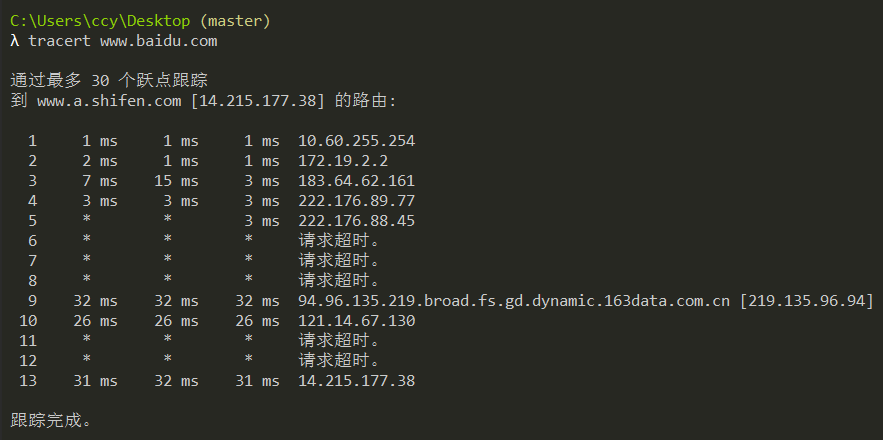

可通过网站 http://ip.cn 查看这些节点位于何处，是哪个公司的，大致清楚本机到百度服务器之间的路径。通过以上查询结果，我们能了解到经过8个节点(这里演示3个)，各节点的位置。如下表所示: 
| 您查询的IP：|所在地理位置：|
| :--: |:--: |
172.19.2.2|内网IP 内网IP|
183.64.62.161|中国 重庆 重庆市 电信|
14.215.177.38|中国 广东省 广州市 电信|
### **实作二：**
ping.pe 这个网站可以探测从全球主要的 ISP 到某站点如 https://qige.io 的线路状态，当然也包括各线路到该主机的路由情况。请使用浏览器访问 http://ping.pe/qige.io 进行了解。如下图所示：

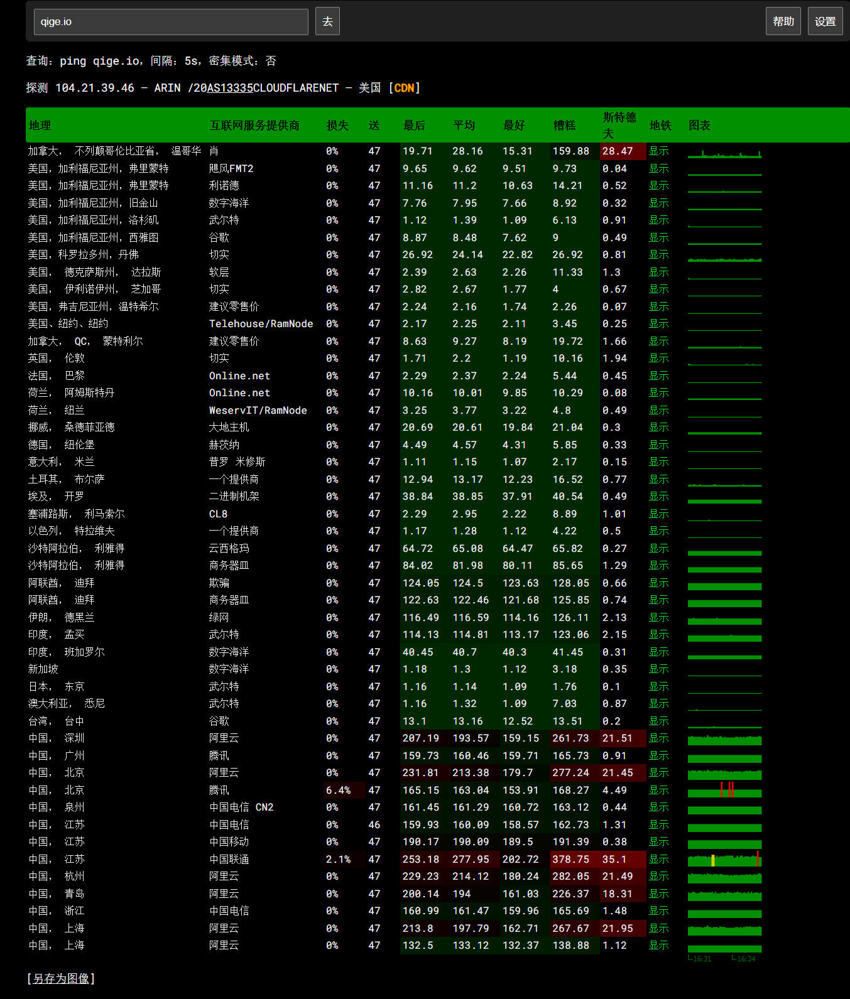

✎ 问题一:
tracert 能告诉我们路径上的节点以及大致的延迟等信息，那么它背后的原理是什么？本问题可结合第二部分的 Wireshark 实验进行验证。

>程序是利用增加存活时间（TTL）值来实现其功能的。每当数据包经过一个路由器，其存活时间就会减1。当其存活时间是0时，主机便取消数据包，并发送一个ICMP TTL数据包给原数据包的发出者。程序发出的首3个数据包TTL值是1，之后3个是2，如此类推，它便得到一连串数据包路径。注意IP不保证每个数据包走的路径都一样。

✎ 问题二:
在以上两个实作中，如果你留意路径中的节点，你会发现无论是访问百度还是棋歌教学网，路径中的第一跳都是相同的，甚至你应该发现似乎前几个节点都是相同的，你的解释是什么？
>我们的电脑在访问外网的时候，经过的第一跳都是本地的交换机（这里是重庆交通大学的交换机），通过交换机才将我们的信号传送出去。后几跳的原理类似。

✎ 问题三:
在追踪过程中，你可能会看到路径中某些节点显示为 * 号，这是发生了什么？
>进行tracert命令时那些节点出于某些原因没有进行回应，所以显示为 * 号。，出现 * 号的路由是因为出于安全考虑或网络问题没有回应。
***
## **ARP**
✍ 地址解析协议，即`ARP（Address Resolution Protocol）`，是根据 `IP`地址获取物理地址的一个`TCP/IP`协议。主机发送信息时将包含目标`IP`地址的`ARP`请求广播到局域网络上的所有主机，并接收返回消息，以此确定目标的物理地址；收到返回消息后将该IP地址和物理地址存入本机`ARP`缓存中并保留一定时间，下次请求时直接查询`ARP`缓存以节约资源。
### **实作一：**
运行 `arp -a` 命令查看当前的 `arp` 缓存， 请留意缓存了些什么。如下图：
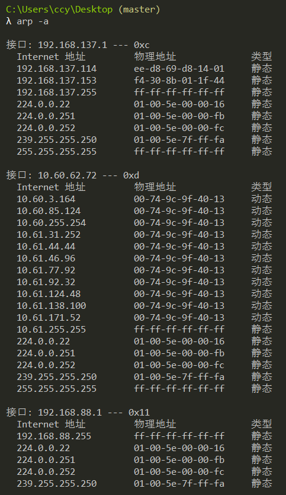
然后 `ping` 一下你旁边的计算机 `IP`（注意，需保证该计算机的 `IP` 没有出现在 `arp` 缓存中，或者使用 `arp -d *` 先删除全部缓存），再次查看缓存，你会发现一些改变，请作出解释。
>该计算机的IP地址和MAC地址会存储在arp缓冲区中，方便下次访问。
### **实作二：**
请使用 arp /? 命令了解该命令的各种选项。如下图：
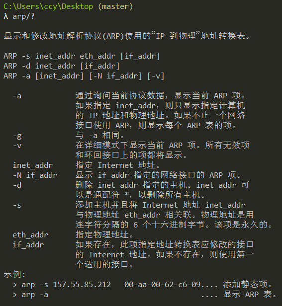
### **实作三:**
一般而言，arp 缓存里常常会有网关的缓存，并且是动态类型的。

假设当前网关的 IP 地址是 192.168.0.1，MAC 地址是 5c-d9-98-f1-89-64，请使用 arp -s 192.168.0.1 5c-d9-98-f1-89-64 命令设置其为静态类型的。
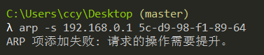
🗣 TroubleShooting

你可能会在实作三的操作中得到 "ARP 项添加失败: 请求的操作需要提升" 这样的信息，表示命令没能执行成功，你该如何解决？
>在管理员模式下运行即可

✎ 问题

在实作三中，为何缓存中常常有网关的信息？
>arp在发数据包前会先发广播包，问谁是目的IP，然后 得到对应的MAC地址，访问外网，你要先到网关那里，也就要知道网关的MAC.缓存为访问过的pc、网卡、mac地址。

我们将网关或其它计算机的 `arp` 信息设置为静态有什么优缺点？
> <font color="pink">优点：</font>: 静态分配IP地址是指给每一台计算机都分配一个固定的IP地址.稳定性更佳 静态`ip`（固定`ip`）可以更稳定,可以作属于自己的网站和服务器.便于管理 一定程度上可以防止arp欺骗，确保安全性
<font color="pink">缺点：</font>: 价格昂贵 静态`ip`（固定`ip`）要采用用专线上网的计算机才拥有固定的所以也需要比较昂贵的费用。设置成静态需要人为的设定，比较麻烦，若后期要修改更为麻烦。
***

##  **DHCP**
✍ DHCP（Dynamic Host Configuration Protocol）即动态主机配置协议，是一个用于 IP 网络的网络协议，位于 OSI 模型的应用层，使用 UDP 协议工作，主要有两个用途：
1. 用于内部网或网络服务供应商自动分配 IP 地址给用户
2. 用于内部网管理员对所有电脑作中央管理
简单的说，DHCP 可以让计算机自动获取/释放网络配置。
### **实作一:**
一般地，我们自动获取的网络配置信息包括：```IP``` 地址、子网掩码、网关 ```IP``` 以及 ```DNS``` 服务器 ```IP``` 等。使用 ```ipconfig/release``` 命令释放自动获取的网络配置，并用 ```ipconfig/renew``` 命令重新获取，了解 ```DHCP``` 工作过程和原理。

✎ 问题

在`Windows`系统下，如果由于某种原因计算机不能获取 `DHCP` 服务器的配置数据，那么Windows将会根据某种算法自动配置为 `169.254.x.x` 这样的 `IP` 地址。显然，这样的 `IP` 以及相关的配置信息是不能让我们真正接入 `Internet` 的，为什么？既然不能接入 `Internet`，那么`Winodws`系统采用这样的方案有什么意义？

📬 秘籍

在我校不少地方如教室，计算机都采用了 `DHCP` 来获得网络配置。假如某天因 `DHCP` 服务器问题从而不能获得网络配置，那么我们可以查看隔壁教室计算机的配置信息来手动进行网络配置，从而使该计算机能够接入 `Internet`。
>`169.254.x.x`为内部地址，外网无法访问内部地址；这是`Windows`操作系统为了防止主机脱网，为网卡设置`169.254.x.x`的保留`IP`，此时就算由于某种原因计算机不能获取 `DHCP` 服务器的配置数据时，他们还通过保留地址还可以互相通讯。自动配置的IP地址和信息只是短暂性的解决计算机不能获取 `DHCP` 服务器的配置数据的问题，要真正的接入`Internet`还需要本身计算机的正确IP地址。

经常的，在一个固定地方的网络配置我都喜欢采用 静态/手动配置，而不是动态 `DHCP` 来进行。你能想到是什么原因吗？
>动态`IP`需要在连接网络时自动获取`IP`地址以供用户正常上网，而静态`IP`是`ISP`在装机时分配给用户的`IP`地址，可以直接连接上网，不需要获取`IP`地址，该`IP`在`ISP`装机时会划分一个`IP`地址给你，让计算机在连接网络时不再自动获取网络地址，避免了网络连接上的困扰。
动态`IP`和`静态IP`对网速的影响：`ISP`对每个用户所提供的网速，并不是从IP地址限定的，而是从用户连接到ISP的物理线路上进行限定的。
***
## **netstat**
✍ 无论是使用 `TCP` 还是 `UDP`，任何一个网络服务都与特定的端口`（Port Number）`关联在一起。因此，每个端口都对应于某个通信协议/服务。

`netstat（Network Statistics）`是在内核中访问网络连接状态及其相关信息的命令行程序，可以显示路由表、实际的网络连接和网络接口设备的状态信息，以及与 `IP、TCP、UDP `和` ICMP `协议相关的统计数据，一般用于检验本机各端口的网络服务运行状况。
### **实作一：**
`Windows` 系统将一些常用的端口与服务记录在 `C:\WINDOWS\system32\drivers\etc\services` 文件中，请查看该文件了解常用的端口号分配。如下图(部分)

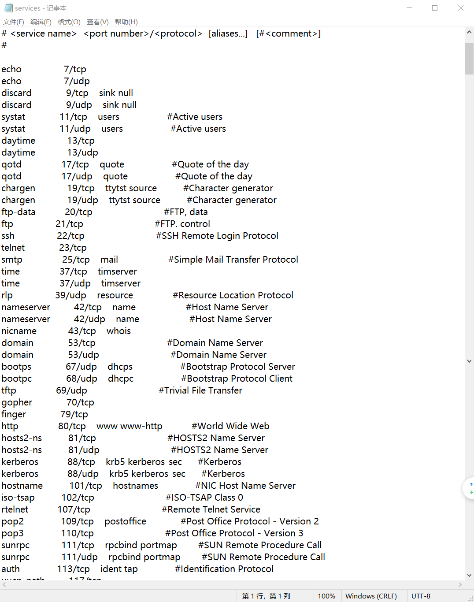

计算机端口号总数：65535，一般用到的是1~65535，0一般不使用
* 0-1023： 系统端口，也叫公认端口，这些端口只有系统特许的进程才能使用；
* 1024~65535：为用户端口：
* 1024-5000： 临时端口，一般的应用程序使用1024到4999来进行通讯；
* 5001-65535：服务器(非特权)端口，用来给用户自定义端口。
#### ***常用端口号及说明：***
协议/服务名称 | 端口号 |简介 |
:--:| :--: |:--: |
ftp	|20、21|File Transfer Protocol 文件传输协议，20用于连接，21用于传输|
ssh|22| Secure Shell 安全外壳协议，专为远程登录会话和其他网络服务提供安全性的协议|
http|80|Hyper Text Transfer Protocol 超文本传输协议，用于网页浏览|
DNS|53|Domain Name System 域名系统，域名解析|
https|443|Hypertext Transfer Protocol Secure 超文本传输安全协议，用于安全浏览网页|
www代理服务|8080|	Apache Tomcat web server，进行网页浏览|
smtp|25|Simple Mail Transfer Protocol 简单邮件传输协议|
telnet|23|	不安全的文本传送|
pop3|110|Post Office Protocol|

### **实作二：**
使用 `netstat -an` 命令(如下图)，查看计算机当前的网络连接状况。更多的 `netstat`命令选项，可参考链接 [`netstat 命令用法详解一`](https://www.jianshu.com/p/b866f3f6e46e)和 [`netstat 命令用法详解二`](https://blog.csdn.net/weixin_39800144/article/details/80929947) 。
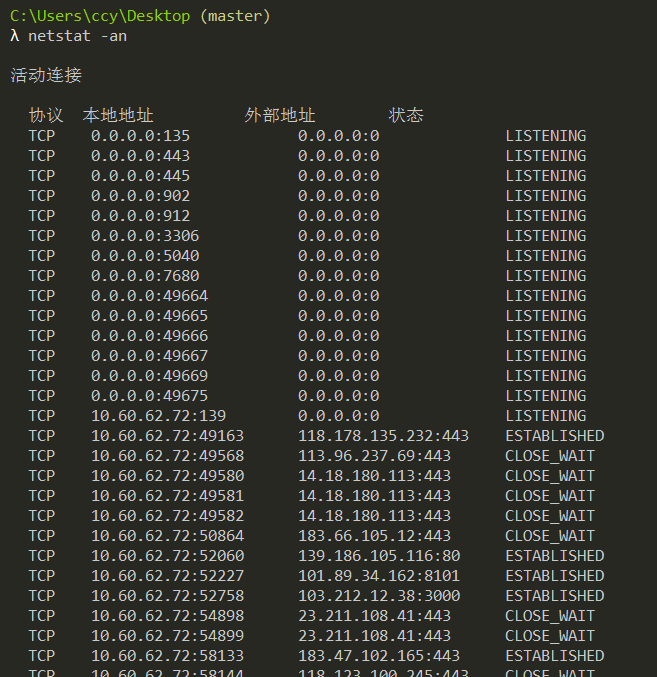
可以看到本机计算机网络连接状态分为三种：`LISTENING、ESTABLISHED、CLOSE_WAIT`
>1、`LISTENING`状态
　　`FTP`服务启动后首先处于侦听`（LISTENING）`状态。
2、`ESTABLISHED`状态
　　`ESTABLISHED`的意思是建立连接。表示两台机器正在通信。
3、`CLOSE_WAIT`状态
    对方主动关闭连接或者网络异常导致连接中断，这时我方的状态会变成`CLOSE_WAIT`此时我方要调用`close()`来使得连接正确关闭

除此之外还有两种状态：
>4、`TIME_WAIT`状态
    我方主动调用 `close()` 断开连接，收到对方确认后状态变为`TIME_WAIT`。`TCP`协议规定`TIME_WAIT`状态会一直持续`2MSL`(即两倍的分段最大生存期)，以此来确保旧的连接状态不会对新连接产生影响。处于`TIME_WAIT`状态的连接占用的资源不会被内核释放，所以作为服务器，在可能的情况下，尽量不要主动断开连接，以减少`TIME_WAIT`状态造成的资源浪费。
    目前有一种避免`TIME_WAIT`资源浪费的方法，就是关闭socket的`LINGER`选项。但这种做法是`TCP`协议不推荐使用的，在某些情况下这个操作可能会带来错误。
5、`SYN_SENT`状态
    `SYN_SENT`状态表示请求连接，当你要访问其它的计算机的服务时首先要发个同步信号给该端口，此时状态为`SYN_SENT`，如果连接成功了就变为`ESTABLISHED`，此时`SYN_SENT`状态非常短暂。但如果发现SYN_SENT非常多且在向不同的机器发出，那你的机器可能中了冲击波或震荡波之类的病毒了。这类病毒为了感染别的计算机，它就要扫描别的计算机，在扫描的过程中对每个要扫描的计算机都要发出了同步请求，这也是出现许多`SYN_SENT`的原因

打开的计算机端口，就是向 `Internet` 打开的一个通道。通过 `netstat` 命令，我们可以了解当前计算机哪些端口是打开的，从而找出一些恶意后台程序，分析其所作所为，并且可以进一步将相关端口关闭，降低安全风险。

***

## **DNS**
✍ `DNS（Domain Name System）`即域名系统，是互联网的一项服务。它作为将域名和`IP` 地址相互映射的一个分布式数据库，能够使人更方便地访问互联网。`DNS` 使用 `TCP` 和 `UDP` 的 `53` 号端口。

### **实作一:**
Windows 系统将一些固定的/静态的 `DNS` 信息记录在 `C:\WINDOWS\system32\drivers\etc\hosts` 文件中，如我们常用的 `localhost` 就对应 `127.0.0.1` 。请查看该文件看看有什么记录在该文件中。
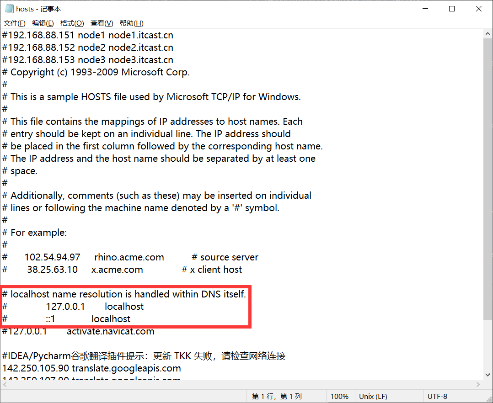

### **实作二:**
解析过的 DNS 记录将会被缓存，以利于加快解析速度。请使用 `ipconfig /displaydns` 命令查看（如下图)。我们也可以使用 `ipconfig /flushdns`命令来清除所有的 DNS 缓存(不再演示)。
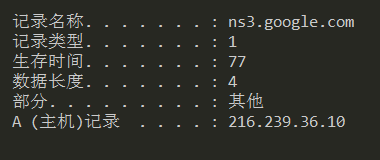
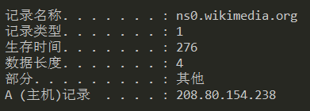

### **实作三:**
使用 `nslookup qige.io` 命令，将使用默认的 `DNS` 服务器查询该域名。当然你也可以指定使用 `CloudFlare（1.1.1.1）`或 `Google（8.8.8.8）` 的全球 `DNS` 服务器来解析，如：`nslookup qige.io 8.8.8.8`，当然，由于你懂的原因，这不一定会得到正确的答案。如下两张图：
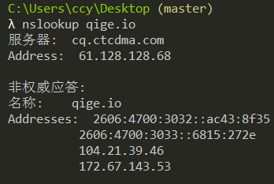
.png)
>📬 秘籍
>当我们使用浏览器上网时，或多或少的会看到一些广告。某些网站的广告是非常没有节操的，所以我们一般可以通过安装浏览器插件如 `AdGuard、AdBlocker` 等来拦截和过滤。
这种方法简单方便有效，不过有一定安全或隐私问题，因为该插件实时知道你访问的 `URL`。
假设不使用这种第三方的插件，希望自己完全控制，那么就请考虑在我们前面提到的 `hosts` 文件中添加 `DNS` 记录。有自愿者时时在维护全球正确的 `DNS` 记录文件 [`hosts-1`](https://github.com/otobtc/ADhosts/blob/master/hosts)和[`hosts-2`](https://cdn.jsdelivr.net/gh/neoFelhz/neohosts@gh-pages/full/hosts) 

🗣 TroubleShooting
上面秘籍中我们提到了使用插件或自己修改 `hosts` 文件来屏蔽广告，思考一下这种方式为何能过滤广告？如果某些广告拦截失效，那么是什么原因？你应该怎样进行分析从而能够成功屏蔽它？
>原理是再`hosts`文件中将广告域名对应的`ip`写为本机。如果某些广告拦截失效，可能是这个广告域名改了，而我们的`hosts`文件中有没有写入这个新域名对应本机，所以拦截失败，这是就需要向`hosts`文件中写入这个新域名对应为本机，这样就可以屏蔽这个之前屏蔽失败的广告了

***

## **cache**
✍ cache 即缓存，是 IT 领域一个重要的技术。我们此处提到的 cache 主要是浏览器缓存。
浏览器缓存是根据 HTTP 报文的缓存标识进行的，是性能优化中简单高效的一种优化方式了。一个优秀的缓存策略可以缩短网页请求资源的距离，减少延迟，并且由于缓存文件可以重复利用，还可以减少带宽，降低网络负荷。
### **实作一**
打开 Chrome 或 Firefox 浏览器，访问 https://qige.io ，接下来敲 F12 键 或 Ctrl + Shift + I 组合键打开开发者工具，选择 Network 面板后刷新页面，你会在开发者工具底部看到加载该页面花费的时间。请进一步查看哪些文件被 cache了，哪些没有。如下图：
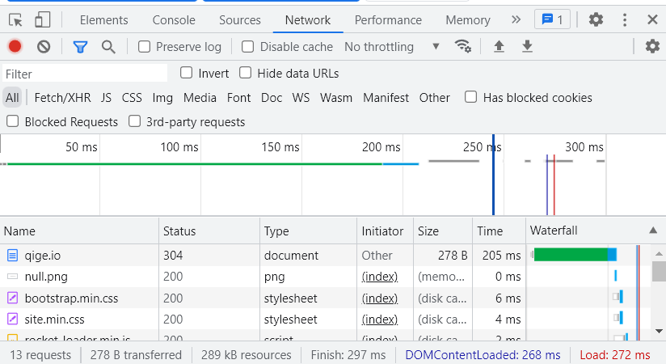

### **实作二**
接下来仍在 Network 面板，选择 Disable cache 选项框，表明当前不使用 cache，页面数据全部来自于 Internet，刷新页面，再次在开发者工具底部查看加载该页面花费的时间。你可比对与有 cache 时的加载速度差异。
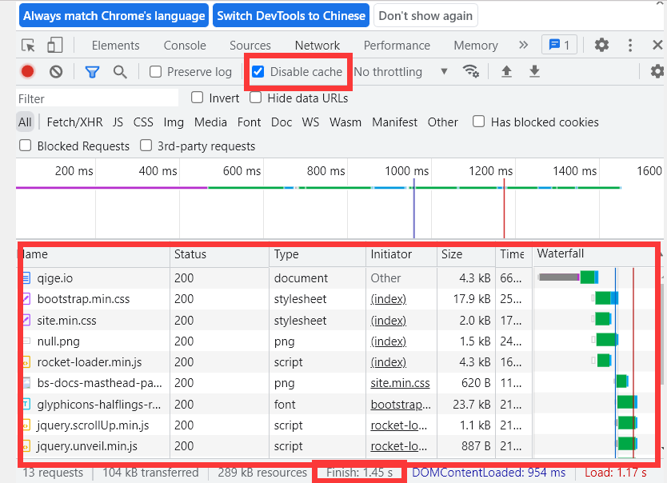
对比实验一的图`Finish=297ms`,该图的`Disable cache`后的`Finish=1.45s`可以明显看出有cache时候的加载速度远远小于不使用cache时的加载速度

>`📬 秘籍`
你的计算机可能还在使用 XX 管家，XX 卫士之类的垃圾软件，那么它可能就会在某些时候提示你计算机的垃圾文件有多少多少，请清理（其实是它本身应该被清理！）之类的弹窗。如果你查看一下它判断的所谓垃圾文件，你会发现大多都是浏览器的缓存，而你已经明白了这些缓存文件的作用。所以，清理吗？
`结论:` cache会缓存一些网页加载过的文件，缓存可大大加快网页加载速度。